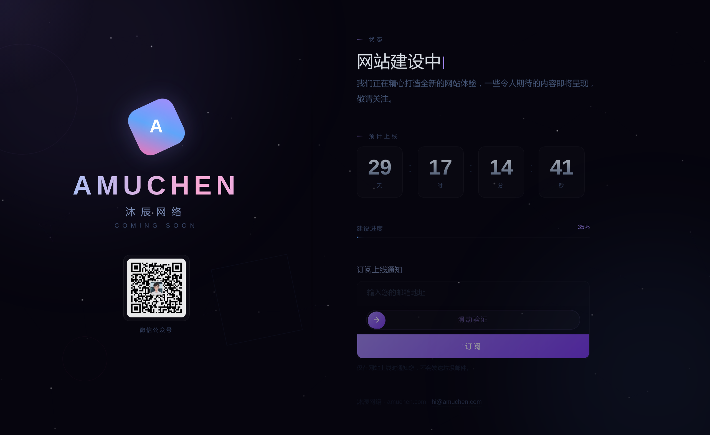

# ✨ 网站建设中 / Coming Soon 页面源码

高颜值网站建设中 / Coming Soon 落地页源码，自带邮箱订阅系统 + 微信推送通知。

纯前端 + PHP，零依赖，开箱即用。

## 预览



> 暗色星空主题 · 粒子动画 · 左右分栏布局

## 功能

### 🎨 前端
- Canvas 星空粒子背景（100 粒子 + 连线动画）
- 鼠标跟随紫色光晕
- 30 天自动倒计时（数字翻转动画）
- 建设进度条
- 邮箱订阅表单 + 滑块验证码
- 微信公众号二维码
- 完整响应式（PC / 平板 / 手机）

### ⚙️ 后端
- 原生 PHP Socket SMTP 发信（零依赖）
- 邮箱格式双重校验（前端 + 后端）
- 邮箱去重
- JSON 文件存储 + 文件锁防并发
- HTML 格式订阅确认邮件
- ShowDoc 微信推送管理员通知

### 🔒 安全
- 滑块验证码防机器人
- localStorage 本地备份
- CORS 跨域支持

## 技术栈

- HTML5 + CSS3（纯手写，无框架）
- Vanilla JavaScript
- PHP 7.0+（原生 Socket SMTP）
- JSON 文件存储

## 快速开始

### 1. 克隆项目

```bash
git clone https://github.com/mcwlgzs/amuchen-coming-soon.git
```

### 2. 配置 SMTP

编辑 `subscribe.php` 顶部：

```php
define('SMTP_HOST', 'smtp.qq.com');
define('SMTP_PORT', 465);
define('SMTP_USER', 'your_email@qq.com');
define('SMTP_PASS', 'your_smtp_auth_code');
define('SMTP_FROM', 'your_email@qq.com');
define('ADMIN_EMAIL', 'admin@qq.com');
define('SHOWDOC_PUSH_URL', 'your_showdoc_push_url');  // 可选
```

### 3. 部署

上传到支持 PHP 的主机，确保 PHP 有写入权限。

```
├── index.html          # 前端页面
├── subscribe.php       # 订阅接口
├── subscribers.json    # 自动生成
└── qrcode_xxx.jpg      # 替换成你的二维码
```

## 自定义

| 项目 | 位置 | 说明 |
|------|------|------|
| 品牌名 | index.html | 搜索 `AMUCHEN` / `沐辰网络` 替换 |
| 倒计时 | JS `setDate(+30)` | 改数字调整天数 |
| 进度 | CSS `progressGrow` + HTML `35%` | 改百分比 |
| 主色 | 全局 `#a78bfa` | 搜索替换即可 |
| 邮件模板 | subscribe.php | 修改 HTML 邮件内容 |

## 邮件效果

订阅成功后：
- 用户收到紫色渐变主题的 HTML 确认邮件
- 管理员通过 ShowDoc 收到微信推送（含邮箱、IP、时间、总数）

## 环境要求

- PHP 7.0+（需支持 `fsockopen`）
- 服务器允许出站 465 端口
- PHP 对项目目录有写入权限

## 浏览器兼容

Chrome / Edge / Firefox / Safari 最新版，iOS Safari / Android Chrome。

## 许可证

MIT

---

如果觉得有用，给个 ⭐ Star 支持一下。
